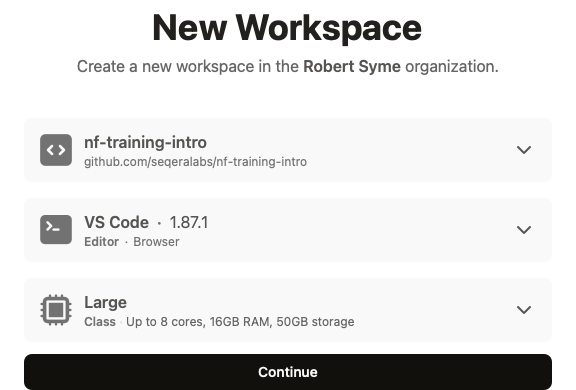
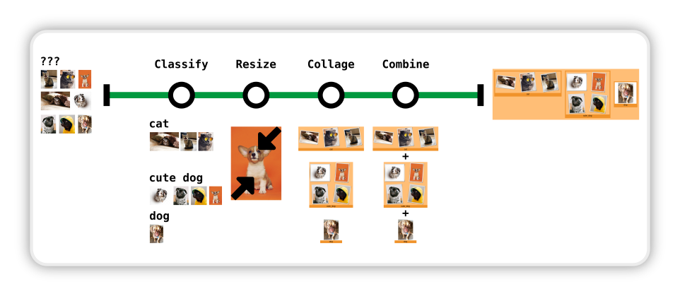

# Go with the (Next)flow!

**Welcome to our introductory session on Nextflow!**

[Nextflow](https://www.nextflow.io/) is a powerful workflow language designed to streamline complex computational workflows, often used in fields like bioinformatics. The goal of this training workshop is not to transform you overnight into a coding expert or bioinformatics scientist. Instead, we aim to highlight the key features and capabilities offered by using Nextflow with a set of very simple, relatable examples that should be digestible by anyone!

By the end of this workshop, you will grasp the essentials as to why Nextflow is a leading solution for managing large-scale data analysis and how it empowers users to achieve remarkable scientific breakthroughs with efficiency and flexibility.

More specifically, this session will cover the following key capabilities of Nextflow:

- **Scalability**
- **Parallelism**
- **Reproducibility**
- **Resumability**
- **Reporting**
- **Flexibility**

If you walk away from this workshop being able to understand and communicate these advantages to others then we will consider the workshop a success!

## Getting started

For this workshop, we are going to be using a tool called [`GitPod`](https://www.gitpod.io/), which provides us with a fully managed environment to deliver the training. You will need a GitHub account, so if you don't have one, go to [GitHub](https://github.com/) and create one for yourself.

### Open the GitPod environment

You can begin a new Gitpod environment by following the link below:

[](https://gitpod.io/?workspaceClass=g1-large&editor=code&autostart=false#https://github.com/seqeralabs/nf-training-intro)

This will bring you to the Gitpod launch screen where you can click "Continue":



### Interacting with the command-line

Please don't worry if you are unfamiliar with command-line environments, you will just be copying commands to follow along.

The major difference between a command-line environment and conventional interfaces like Windows or macOS is that you have to issue commands to do even the simple things you normally take for granted in a graphical user interface.

For example, you would issue the following commands:

- To enter a folder called `data/`

```bash
cd data
```

- List files in a folder:

```bash
ls
```

- Go back up a level to a parent folder:

```bash
cd ..
```

## Solving critter blindness

### The background

In the different sections of this tutorial, we will explore how to run an existing classification model using OpenAI's Contrastive Language–Image Pre-training ([CLIP](https://openai.com/research/clip)). It is a versatile tool that can understand and classify images based on natural language descriptions. Again don't worry, the previous sentence is a mouthful of random words to most of us - all will become clear as we progress through the tutorial!

### The challenge

We have intentionally picked a use case quite different from the usual scientific workloads, to make the transferability of the concepts more relatable as we progress through the workshop.

You have been given a set of pictures of your colleagues' animals, and you want to be able to classify them, so you can make attractive collages of them to present at your company retreat. Unfortunately, you have developed cat/dog/spider blindness and can't classify the critters with the naked eye. Although we are not quite yet in the days of an adult John Connor, fortunately for you this is 2024, so you can still enlist the help of AI.

### The aim

To make this workshop palatable for everyone we have already:

- Dumped a bunch of animal pictures in the [`data/`](./data/) folder.
- Written a simple Python script called [`classify.py`](./bin/classify.py), which uses CLIP to classify the bloomin' critters.

Your mission should you choose to accept is going to be to:

- Use CLIP to assign critters to classes based on a list of labels you provide.
- Make a collage of the critters in each class.
- Combine the collages to create a single, glorious critter cornucopia.



## Exercises

This workshop has been split up into 4 sections with decreasing manual intervention to highlight the key strengths of Nextflow. The last section will help to contextualize how we can leverage Nextflow in combination with the [Seqera Platform](https://seqera.io/) to solve challenges like scalability and parallelism.

Once you have successfully provisioned a GitPod environment (see [Getting Started](#getting-started)) please complete the following critter classification sections in order:

- [Part 1: Using the command-line](docs/part1-cli.md)
- [Part 2: Using Bash scripting](docs/part2-bash.md)
- [Part 3: Using Nextflow](docs/part3-nextflow.md)
- [Part 4: Using the Seqera Platform](docs/part4-platform.md)

## Summary

Congratulations on completing Go with the (Next)flow! 🎉 You've now gained a base-level understanding of Nextflow, its integration within the Platform, and why Seqera is the preferred choice for our customers.

In summary, you should have a concrete understanding of the key capabilities of Nextflow:

- **Scalability**
- **Parallelism**
- **Reproducibility**
- **Resumability**
- **Reporting**
- **Flexibility**

## Resources

- [Seqera website](https://seqera.io/)
- [Nextflow docs](https://www.nextflow.io/docs/latest/index.html)
- [nf-core website](https://nf-co.re/)
- [Seqera Platform docs](https://docs.seqera.io/)
- [GitHub website](https://github.com/)
- [GitPod website](https://www.gitpod.io/)
- [CLIP website](https://openai.com/research/clip)
- [CLIP package repository](https://github.com/openai/CLIP)
