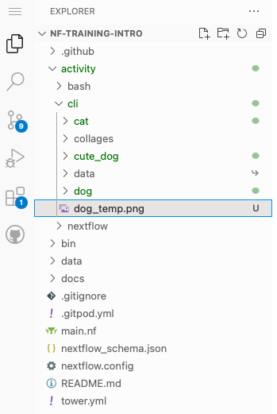

# Part 1: Critter classification with the command-line

## Visual Studio Code

Once Gitpod has started, you should see a set of panes displaying lots of information. This is Visual Studio Code (VS Code), software designed for developing other software, known as an Integrated Development Environment (IDE). You may be familiar with it already, but if you are not there are three main windows we will be interacting with.

1. The code editor which is central. This is where will **view and edit code**.
2. The file browser on the left. This is where we can **explore and open files**.
3. The terminal or command-line on the bottom. This is how we will be **interacting with software**.

If you would like any further information, please check out this [introductory documentation for VS Code](https://code.visualstudio.com/docs/introvideos/codeediting).

## What is the command-line?

A command-line interface (CLI) is a means of interacting with a computer program by inputting lines of text called command-lines ([Wikipedia](https://en.wikipedia.org/wiki/Command-line_interface)). While it may seem daunting at first glance, it is a simple, text-only interface, and incredibly powerful tool that offers a direct way to communicate with and control your computer.

### Interacting with the command-line

Please don't worry if you are unfamiliar with command-line environments, you will just be copying commands to follow along.

The major difference between a command-line environment and conventional interfaces like Windows or macOS is that you have to issue commands to do even the simple things you normally take for granted in a graphical user interface.

For example, you would issue the following commands:

- To enter a folder called `data/`

```bash
cd data
```

- List files in a folder:

```bash
ls
```

- Go back up a level to a parent folder:

```bash
cd ..
```

In this section of our Nextflow workshop, we'll explore how to run an existing classification model using OpenAI's CLIP directly from the command-line, to both classify our critters and build a collage of images.

## Step 1: Find the critters

For this exercise, we have created a folder called [`exercise/cli/data`](../exercise/cli/data) that just contains a copy of all of the original animal images in the top-level [`data/`](../data/) folder.

You can either navigate to this directory via the File Explorer sidebar in the VS Code user interface in Gitpod, or the command-line. This is a good example of how you can do exactly the same thing through the user interface and the command-line.

1. Let's list all of the files in the current folder using the command-line by running the [`ls`](https://man7.org/linux/man-pages/man1/ls.1.html) command. You should see the `exercise` folder as shown below:

   ```console
   ls
   ```

   ```
   # Output:
   README.md  exercise  assets  bin  data  docs  main.nf  nextflow.config  nextflow_schema.json  tower.yml
   ```

2. You can either navigate directly to the `exercise/cli/` folder by issuing the command below:

   ```bash
   cd exercise/cli
   ```

   or you can run multiple [`cd`](https://linuxcommand.org/lc3_man_pages/cdh.html) commands to get there too:

   ```bash
   cd exercise
   cd cli
   ```

If you get lost, you can always close the terminal using the trash can icon on the right-hand side and then open up a fresh new terminal. In a fresh terminal, to move to the correct directory for the first part of the exercise, you will need to type the command below and press return:

```bash
cd exercise/cli
```

3. You can check you are in the correct folder by using the [`pwd`](https://man7.org/linux/man-pages/man1/pwd.1.html) (print working directory (folder)) command:

   ```console
   pwd
   ```

   ```
   # Output:
   /workspace/nf-training-intro/exercise/cli
   ```

4. List the contents of the `data` folder:

   ```console
   ls data
   ```

   ```
   # Output:
   aussie.png  chihuahua.png  dog.png  hiding.png  pug.png  rain-ready.png  reflective.png  yawn.png
   ```

Now that you are in the correct location relative to where the input images are stored, you will be able to run the classification with the images in `data/`.

## Step 2: Label each image

In this step of the tutorial, we will explore how to run an existing classification model using OpenAI's CLIP tool directly from the command-line, to classify our critters.

The main command we will be using looks like this:

```bash
classify.py --image <YOUR_PICTURE> --labels '<LABEL_1>,<LABEL_2>,<LABEL_3>' > out.txt
```

Let's break this down:

1. `classify.py` is the Python script we have created to run the classification model
2. `--image <YOUR_PICTURE>` specifies the image file we would like to classify as input
3. `--labels '<LABEL_1>,<LABEL_2>,<LABEL_3>'` is the set of labels/classifiers we want to assign to the images
4. `> out.txt` allows us to save the results or output of the classification into a file called `out.txt` that we can read later.

Now let's run the `classify.py` script on a single dog pic called [`rain-ready.png`](../exercise/cli/data/rain-ready.png) and see which classifier CLIP assigns to it!

```
classify.py --image data/rain-ready.png --labels 'animal,cat,ugly_dog,cute_dog'
```

```
# Output:
cute_dog
```

This should return a text output onto the command-line telling you which of the input labels was most likely to apply to the picture we specified as input. In this case, the critter was a `cute_dog`! We are not limited to the labels we used above, for example, you can also specify `--labels 'cat,dog,zebra,crocodile'`, or any other set of comma-separated labels.

For simplicity, let's use the same labels, classify each of the 8 images individually and then copy them into a folder based on the classification:

### Classify each image individually

a. Aussie:

```console
classify.py --image data/aussie.png --labels 'cat,dog,cute_dog'
```

which should return `cute_dog`

<br>

b. Chihuahua:

```console
classify.py --image data/chihuahua.png --labels 'cat,dog,cute_dog'
```

which should return `cute_dog`

<br/>
c. Dog:

```console
classify.py --image data/dog.png --labels 'cat,dog,cute_dog'
```

which should return `dog`

<br>
d. Cat hiding:

```console
classify.py --image data/hiding.png --labels 'cat,dog,cute_dog'
```

which should return `cat`

<br>
e. Pug:

```console
classify.py --image data/pug.png --labels 'cat,dog,cute_dog'
```

which should return `cute_dog`

<br/>
f. Pug with a raincoat:

```console
classify.py --image data/rain-ready.png --labels 'cat,dog,cute_dog'
```

which should return `cute_dog`

<br>
g. Cat with sunglasses

```console
classify.py --image data/reflective.png --labels 'cat,dog,cute_dog'
```

which should return `cat`

<br/>
h. Cat yawning:

```console
classify.py --image data/yawn.png --labels 'cat,dog,cute_dog
```

which should return `cat`

### Create folders for each label

Create individual folders for each label with the [`mkdir`](https://man7.org/linux/man-pages/man1/mkdir.1.html) (make directory (folder)) command:

```bash
mkdir cat
mkdir dog
mkdir cute_dog
```

### Copy each image to a folder based on the classifier label

```bash
cp data/aussie.png cute_dog
```

```bash
cp data/chihuahua.png cute_dog
```

```bash
cp data/dog.png dog
```

```bash
cp data/hiding.png cat
```

```bash
cp data/pug.png cute_dog
```

```bash
cp data/rain-ready.png cute_dog
```

```bash
cp data/reflective.png cat
```

```bash
cp data/yawn.png cat
```

Just out of interest, did your copy paste skills take a carpal tunnel battering there?

Now you should have 3 directories labelled by critter:

1. A `dog/` folder with all of the images that were labelled as `'dog'`
2. A `cat/` folder with all the images labelled as `'cat'`
3. A `cute_dog/` folder with all the images labelled as `'cute_dog'`

You can also list the images that ended up in each directory by using the command below:

```bash
ls dog
```

## Step 3: Resize all images for each classifier

To make sure the images in our final collage are of a uniform size, let's run a resize command on the contents of the three folders:

First we'll make a separate directory with the `mkdir` command to store our resized images, based on the label:

```bash
mkdir -p resized/dog
mkdir -p resized/cat
mkdir -p resized/cute_dog
```

Second, we will run a command with the[`mogrify`](https://imagemagick.org/script/mogrify.php) image modification tool to resize our images for each classifier:

a. First for `dog/`:

```bash
mogrify -resize 100x100 -path resized/dog -format png dog/*
```

b. Second for `cat/`:

```bash
mogrify -resize 100x100 -path resized/cat -format png cat/*
```

c. Third for `cute_dog/`:

```bash
mogrify -resize 100x100 -path resized/cute_dog -format png cute_dog/*
```

## Step 4: Make a collage for each classifier

Now let's try to create a collage of each of the directories containing label-specific images. We will be using a tool called [`montage`](https://imagemagick.org/script/montage.php) to create the collage. This tool will take as input a list of images and output a collage in PNG format.

1. Create a `collages` folder:

   ```bash
   mkdir -p collages
   ```

2. Create a temporary image to make a collage with the correct layout for all of the images in the `'dog'` folder:

   ```bash
   montage resized/dog/* dog_temp.png
   ```

> [!TIP]
> You can view the results of this command by clicking the `dog_temp.png` filename in the file explorer on the left-hand side of your window:
> 

To make the collage a little bit more interesting, we can add a few command-line arguments:

```bash
montage -background black +polaroid -background '#ffbe76' resized/dog/* dog_temp.png
```

We can also use the `montage` command to write our classification label into the image:

```bash
montage -label 'dog' -geometry +0+0 -background "#f0932b" dog_temp.png collages/dog.png
```

Now, let's repeat this same process for all of the other labels:

```bash
montage -background black +polaroid -background '#ffbe76' resized/cat/* cat_temp.png
montage -label 'cat' -geometry +0+0 -background "#f0932b" cat_temp.png collages/cat.png
```

## Step 5: Combine the collages

You should now have a set of collages, one for each critter type.

1. List the images that ended up in the `collages/` directory by using the command below:

   ```
   ls collages
   ```

   ```
   # Output:
   cat.png cute_dog.png dog.png
   ```

2. Use `montage` again to combine all of the individual collages into a meta-collage called `collage_all.png`!

   ```bash
   montage -geometry +10+10 -quality 05 -background "#ffbe76" -border 5 -bordercolor "#f0932b" collages/* collage_all.png
   ```

   The `-geometry +10+10` parameter will give us 10px spacing between the collages, the `-quality 05` parameter will compress our final image, and the `-background`, `-border`, and `-bordercolor` parameters add a little colour to the final image.

   You can view the final `collage_all.png` image directly in the GitPod user interface by clicking the filename in the file explorer on the left-hand side. You can also download the image to your local machine by right-clicking the filename and selecting 'Download'.

   Take a look - what do you think?

## Quiz

Try to answer the following questions for yourself:

- How easy would it be to try a new set of labels on this dataset?
- What if there were 1000 images? Would you be happy to follow the above steps for all of them?
- Even if you did, are you confident you would get the commands right if you had to type them out 100 times again?
- How annoyed would you be if you had lost your place halfway through and had to start again?

## Summary

After classifying a few images one by one, you might notice a couple of things. First, it can be quite tedious to type out or copy-paste the command repeatedly for multiple images. Secondly, this method does not scale well if we have hundreds or thousands of images to classify. Imagine having to run each image through the command-line individually—it would be incredibly time-consuming and inefficient.

In the next section of the workshop, [Part 2: Critter classification with Bash scripting](part2-bash.md), we will instead encapsulate these commands into a Bash script. This will not only simplify the process of classifying multiple images but also sets the stage for understanding the power of automation and scalability — key features that Nextflow enhances in more complex workflows.
