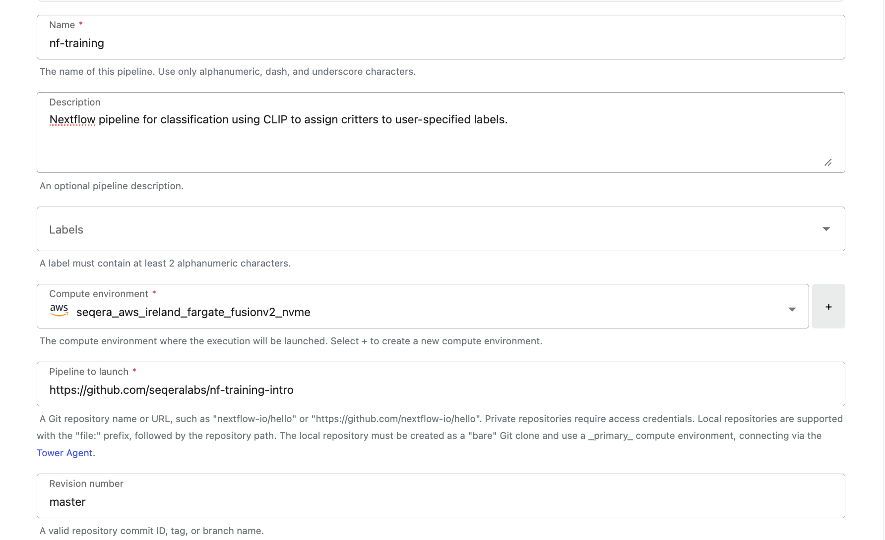
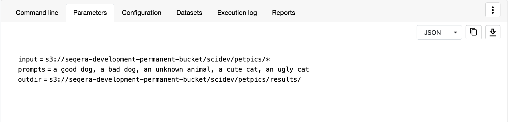
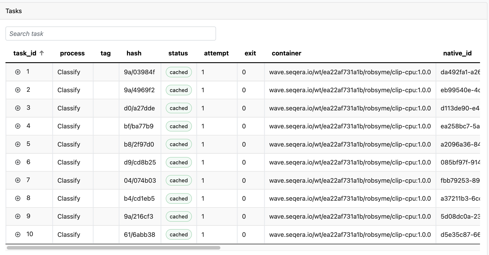
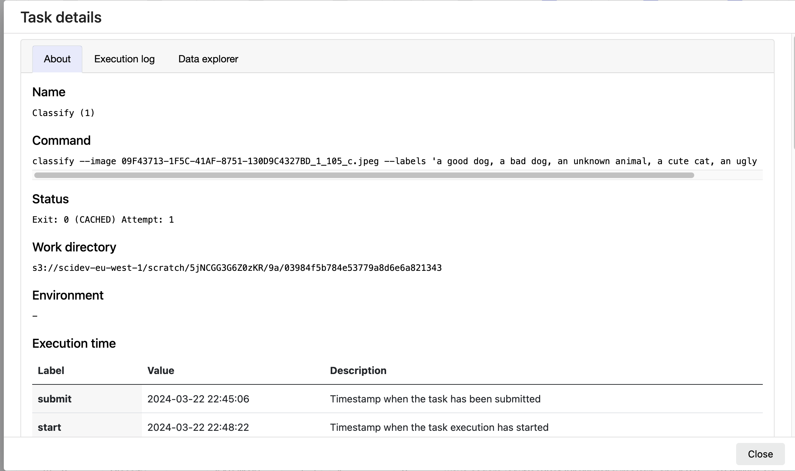

# Part 4: Critter classification on Seqera Platform

## Introduction to Running a Nextflow Workflow on Seqera Platform

Transitioning from crafting our classification steps into Nextflow and running locally, we're now stepping up to Seqera Platform, making our critter-classification project even more collaborative and accessible. This move isn't just about scaling up; it's about bringing collaborators into our fun classification journey, enabling anyone, anywhere, to classify their favorite critters using the same parameters. It's also about effortlessly handling data in the Cloud, without getting tangled in the technicalities, and keeping an eye on costs, ensuring our animal adventure stays budget-friendly. Nextflow Tower is here to make sharing, collaborating, and cloud computing a breeze for our critter-classifying escapades.

## Running the workflow on Seqera Platform

## Step 1: Log in to Seqera Platform

Head over to our beloved [Seqera Platform landing page](cloud.seqera.io) and log in with your Seqera GSuite account. Upon logging in, you will have access to Workspace called `nf-training` under the `seqeralabs` organization.

An AWS Batch Compute Environment with valid credentials has been already set up for you to use.

<!-- TODO: screenshot here maybe -->

## Step 2: Launch the workflow

If you go to the Launchpad in the `seqeralabs/nf-training` workspace, you'll see a pipeline pre-configured on the Launchpad called `nf-training`. You can click on the 'Launch' button to start configuring your run.

 <details>
<summary>Pipeline Configuration Details</summary>
The `nf-training` has already been configured on the Launchpad to use an AWS Compute Environment. When adding the pipeline to the Launchpad, a Pipeline Name, Description, and the Compute Environment available in the Workspace was selected. Additionally, to specify where the Nextflow workflow was being pulled from, the Github repository URL was specified. The pipeline is configured to use the 'Master' branch of the repository.



</details>

As you are brought to the 'Pipeline Parameters' page, you will have the option of specifying which images you can use for classification, based on the `params.input` parameter. In the previous steps, we were using the few images that were provided for you. Let's make this more interesting...

## Step 3: Use data on cloud storage as input

In a valiant effort akin to treasure hunting through the digital realms, we've meticulously combed through the delightful array of critter images found in Seqera's #social-pet-pics channel. These gems have now found a new home in an AWS S3 bucket, eagerly awaiting their moment of fame to be classified into 'cat' or 'dog' versus 'cute cat' or 'cute dog'.

Your goal will be to classify the images in this bucket, in the Cloud.

In previous steps, you were able to view the image files being used as input directly in your Gitpod environment, because they were stored on the same machine. In this case, these files are stored in the cloud which means our current machine can't access them directly. However, you can use the Data Explorer in the Platform to take a look at files in cloud storage similar to the Gitpod environment, but also benefit from endless storage and computing that is afforded by the Cloud.

- Click on the 'Data Explorer' tab and click on the AWS bucket named `s3://seqera-development-permanent-bucket`
- Click on the `scidev/` folder
- Click on any one of the files to preview the image

Without having to log into the AWS Console or use a command-line tool for AWS storage, we are able to view our data in the cloud directly through Data Explorer.

## Step 4: Pipeline Parameters

Now that we have previewed out input data, we continue on with configuring our pipeline to be Launched. Navigate back to the 'Launchpad' and click on the `nf-training` pipeline which will bring you to the pipeline parameters page.

### Input

In the 'input' field on the Parameters page, you can click on the 'Browse' button and use the Data Explorer to choose the `seqera-development-permanent-bucket` bucket. Make sure to specify to use the `scidev/` folder, and include the `*` wildcard character at the end of the path. This will tell Nextflow to use everything in this folder.

```
s3://seqera-development-permanent-bucket/scidev/petpics/*
```

### Labels

Similar to what you had done before, specify a list of labels in the 'prompts' field that you want to use to classify the images. For example, 'dog,cat,cute dog,beautiful dog'. Make sure to separate each label with a comma.

### Output

In our previous examples, we were saving our results of the classification into a local folder called `results/` in our Gitpod environment. On the Cloud however, we want to save our results to a cloud storage bucket, so that we can then also share with our colleagues.

In the 'outdir' field on the Parameters page, you can specify the following path to an output bucket and prefix:

```
s3://scidev-eu-west-1/nf-training/<your_name>/results
```

## Step 5: Launch!

Now you have specified which images your workflow will attempt to classify, indicated which labels on which you will perform classification, and specified where your results will live!

You can go ahead and click 'Launch'. The classification on the images in this bucket will take some time as there are over >200 images to comb through but you are now successfully running a machine learning workflow in the Cloud!

## Step 6: Inspect the Results

Once the run completes successfully, you will be able to view the final collage directly in the Platform through the 'Reports' feature.

- Click on the Run
- Navigate to the 'Reports' tab
- Click on the final collage file titled `collage.compressed.jpeg`

You'll be able to not only view the collage in the Platform, but also download it as well - all while still storing it in the Cloud and not having to worry about using up storage locally. You'll notice that the 'Path' for the collage file will point to the bucket path which you had specified in Step 4 as your output directory, or `outdir`.

## Step 7: Inspect the Run details

At the top of the page for you Run, in the 'Parameters' and 'Configuration' tabs, you will be able to see the exact pipeline parameters and Nextflow configuration used, respectively. In the Parameters, you will be able to see which prompts or labels were used for classification, which inputs were specified, and where the results are saved. This is helpful for reproducing results from a previous run, or a colleague's run.



In the earlier part of our tutorial, we closely observed the specific commands executed for each step of our workflow, along with the containers that provided the necessary software. Wondering how to access this information on the Platform?

Navigate to the bottom of your Run's page until you reach the 'Tasks' table.


Select any task listed here to open the 'Task Details' window. Here's what you'll find:


- 'Command': This shows the precise command that was executed for the task, reminiscent of the manual command-line executions you performed in Part 1.
- 'Container': Identifies the container image that executed the command. This harks back to Part 3, where we assigned container images to our workflow's processes using the `container` variable.

Additionally, you'll discover specifics about the 'machineType' or virtual machine utilized for the task, alongside the resources consumed, such as memory, CPUs, and disk space. Having access to such comprehensive details while running pipelines in the Cloud is crucial. It helps us gauge our cloud resource utilization, aiming for cost-efficiency without compromising on the limitless compute and storage capabilities the cloud offers.

## Conclusions

You've now journeyed from the simplicity of command-line commands, through the structured approach of Bash scripting, and into the expansive realm of Nextflow, mastering a suite of powerful techniques for data analysis. Each step has brought its own set of advancements: from the manual specificity of the command-line, we moved to the automated efficiency of Bash scripting, only to surpass it with Nextflow's scalability, parallelism, and reproducibility.

More specifically, Nextflow allows us to achieve the following:

- **Scalability**: Nextflow allows workflows to automatically scale across multiple computing environments, from a single Gitpod environment to high-performance computing clusters and cloud environment with minimal manual configuration.
- **Parallelism**: By decomposing a workflow into smaller, independent tasks, Nextflow can execute these tasks in parallel, significantly speeding up the overall process.
- **Reproducibility**: Nextflow ensures reproducibility by encapsulating each task in containers, like Docker, which packages all necessary software and dependencies. This means that workflows can be rerun under the same conditions, even on different systems (Gitpod, AWS), and produce the same results.
- **Resumability**: Workflows in Nextflow can be paused and resumed at any point without rerunning completed tasks.
- **Reporting**: Nextflow provides detailed reports and logs for each workflow execution, including metrics on resource utilization, task execution times, and success/failure statuses. Seqera Platform additionally allows us to view results of our pipeline quickly and provides insight into the workflow's performance and aiding in troubleshooting and optimization.
- **Flexibility**: Nextflow supports flexibility in execution platforms (local, cloud, HPC), as well as languages (Python scripts like `classify.py`, R scripts, Bash) making it highly adaptable to different computing needs.

Nextflow has not only enabled you to create robust, adaptable workflows but also ensured that these workflows can be precisely replicated and shared, thanks to its focus on reproducibility and detailed reporting. The leap to running these workflows on Seqera Platform demonstrates the transformative power of cloud execution, enhancing your projects with unparalleled scalability and flexibility. You can now not only classify 200 images, but 500, or 1000 images!

By harnessing the Platform's management and monitoring capabilities, we've seen how tasks can transition seamlessly from local development to cloud-based execution, embodying the ultimate promise of Nextflow's portability, resumability and flexibility.

So, here's to you, the maestro of this critter classification concerto, for embracing the flow and charting a path through the digital wilderness with "Go with the Next(flow)"!
